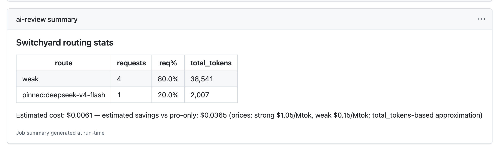

# switchyard-action

Run the [NVIDIA NeMo Switchyard](https://github.com/NVIDIA-NeMo/Switchyard) router (based on [switchyard-opencode-bundle](https://github.com/himorishige/switchyard-opencode-bundle)) inside GitHub Actions. AI tasks in CI are automatically routed between deepseek-v4-pro (strong) and deepseek-v4-flash (weak), and per-run routing stats are saved as workflow artifacts.

The action is client-agnostic. It starts the router, hands you an OpenAI-compatible `base-url`, and collects stats in a post step — anything that speaks the OpenAI or Anthropic API (opencode, Claude Code, codex, pr-agent, plain curl) can sit on top.

> **Status: experimental.**

## What it does

- **Router in your job** — starts the Switchyard router container on `127.0.0.1:<port>` and waits for it to become healthy
- **Per-run cost visibility** — a post step collects routing stats automatically (even when the job fails) and renders a per-route table (requests, tokens, estimated cost, estimated savings) in the run's Step Summary
- **Artifacts for aggregation** — normalized routing logs (JSONL) are uploaded as `switchyard-stats-<run_id>-<job>`, so you can fetch everything later and aggregate locally, including feeding the rollup to an LLM

The post step renders the routing breakdown on the run page like this.



## Quick start — inline PR review with opencode

The workflow below posts a native GitHub pull request review with line-anchored inline comments, routed through Switchyard. You need a `FIREWORKS_API_KEY` repository secret; `use_github_token: 'true'` lets the opencode action work without installing the opencode GitHub App.

```yaml
# .github/workflows/ai-review.yml
name: AI Review
on:
  pull_request:

permissions:
  contents: read
  pull-requests: write
  issues: write

concurrency:
  group: ai-review-${{ github.event.pull_request.number }}
  cancel-in-progress: true

jobs:
  ai-review:
    runs-on: ubuntu-latest
    steps:
      - uses: actions/checkout@v4
        with:
          fetch-depth: 0

      # Insurance: if the agent ever leaves the worktree dirty, opencode's
      # auto-commit must not fail on a missing git identity (its error
      # output would leak into the PR progress comment).
      - name: Set git identity
        run: |
          git config user.name "github-actions[bot]"
          git config user.email "41898282+github-actions[bot]@users.noreply.github.com"

      - uses: shuntaka9576/switchyard-action@main
        id: router
        with:
          fireworks-api-key: ${{ secrets.FIREWORKS_API_KEY }}
          task-label: pr-review

      - uses: anomalyco/opencode/github@latest
        env:
          GITHUB_TOKEN: ${{ secrets.GITHUB_TOKEN }}
          OPENCODE_CONFIG_CONTENT: |
            {
              "$schema": "https://opencode.ai/config.json",
              "share": "disabled",
              "autoupdate": false,
              "provider": {
                "switchyard": {
                  "npm": "@ai-sdk/openai-compatible",
                  "options": {
                    "baseURL": "${{ steps.router.outputs.base-url }}",
                    "apiKey": "local-dummy"
                  },
                  "models": {
                    "auto": {},
                    "strong-only": {},
                    "weak-only": {}
                  }
                }
              },
              "model": "switchyard/auto",
              "small_model": "switchyard/weak-only"
            }
        with:
          model: switchyard/auto
          use_github_token: 'true'
          prompt: |
            Review the diff of pull request #${{ github.event.pull_request.number }} in ${{ github.repository }}.

            Publish your findings as a native GitHub pull request review with line-anchored inline comments. Do NOT post your findings as a plain issue comment.

            Never modify, commit, or push any file inside the repository checkout. Work files go to /tmp only.

            Follow these steps exactly:
            1. Run `gh pr diff ${{ github.event.pull_request.number }}` to read the diff. Note the exact file paths and the line numbers on the NEW side of the diff for every finding.
            2. Write /tmp/review.json shaped like this (one entry in "comments" per finding, anchored to the exact changed line the finding refers to):
               {"event":"COMMENT","body":"<one-paragraph overall summary>","comments":[{"path":"<file path>","line":<new-side line number>,"side":"RIGHT","body":"<finding with a concrete fix suggestion>"}]}
            3. Post it with: `gh api repos/${{ github.repository }}/pulls/${{ github.event.pull_request.number }}/reviews --input /tmp/review.json`
            4. Verify the review was created by checking the exit code and the response JSON.
```

Notes on the moving parts.

- The router validates no API key (`local-dummy` is fine); the real Fireworks key exists only inside the router container
- Pick the tier per task with the model name — `switchyard/auto`, `switchyard/strong-only`, or `switchyard/weak-only`
- Without the `prompt`, opencode's default PR review is a single long issue comment rather than an inline review
- The router binds to loopback, so the AI task must run in the **same job** as this action
- An agentic review run takes on the order of minutes; `concurrency` above cancels superseded runs when the PR gets new pushes

## Using any other client

Point whatever you run at `steps.router.outputs.base-url` with any API key value, and pick a model from `auto` / `strong-only` / `weak-only`.

```yaml
      - name: Ask the router directly
        run: |
          curl -sf -X POST "${{ steps.router.outputs.base-url }}/chat/completions" \
            -H 'content-type: application/json' \
            -H 'authorization: Bearer local-dummy' \
            -d '{"model":"auto","messages":[{"role":"user","content":"..."}]}'
```

## Inputs

| Name | Required | Default | Description |
|------|----------|---------|-------------|
| `fireworks-api-key` | ✓ | — | Fireworks API key (passed only into the router container) |
| `task-label` | | `""` | Task label recorded on every routing record, for aggregation and misroute analysis |
| `route-config` | | — | Path to a `route.yaml` overriding the default bundled in the image |
| `image` | | `ghcr.io/shuntaka9576/switchyard:latest` | Router container image |
| `port` | | `4100` | Host port for the router (loopback only) |
| `extra-docker-args` | | `""` | Extra arguments appended to `docker run` |
| `price-strong-per-mtok` | | `1.05` | USD per 1M tokens for the strong model (cost estimation) |
| `price-weak-per-mtok` | | `0.15` | USD per 1M tokens for the weak model (cost estimation) |

## Outputs

| Name | Description |
|------|-------------|
| `base-url` | Router endpoint (`http://127.0.0.1:<port>/v1`) |
| `strong-requests` / `weak-requests` | Request counts per tier (set by the post step; informational) |
| `total-tokens` | Total tokens (set by the post step; informational) |
| `estimated-cost-usd` / `estimated-savings-usd` | Estimated cost and savings vs. strong-only (set by the post step; informational) |

## Local aggregation

No central infrastructure is required. Fetch all artifacts to your machine and aggregate there.

```bash
# Incrementally fetch switchyard-stats-* artifacts into collected/
./scripts/collect.sh shuntaka9576/my-repo

# Multiple repositories at once
./scripts/collect.sh shuntaka9576/repo-a shuntaka9576/repo-b

# Aggregate by repo / task_label / route, print a table, and write summary.json
./scripts/aggregate.py

# Optionally feed the rollup to an LLM for a written report
REPORT_MODEL_BASE_URL=https://api.fireworks.ai/inference/v1 \
REPORT_MODEL=accounts/fireworks/models/deepseek-v4-pro \
./scripts/aggregate.py --ai-report
```

Each artifact contains JSONL normalized to the following shape.

```json
{
  "repo": "myorg/api-server",
  "workflow": "opencode.yml",
  "run_id": 12345678,
  "run_attempt": 1,
  "job": "ai-review",
  "pr": 456,
  "actor": "shuntaka9576",
  "task_label": "pr-review",
  "collected_at": "2026-07-24T09:00:00Z",
  "tier": "strong",
  "model": "accounts/fireworks/models/deepseek-v4-pro",
  "total_tokens": 12345
}
```

## Limitations

- Only usage **inside CI** is measured. Local opencode usage by team members is not included
- Artifacts are retained for 90 days by default. For longer trends, run `collect.sh` periodically — it fetches incrementally, so history accumulates on your machine
- Routing logs do carry `prompt_tokens` / `completion_tokens` / `cached_tokens` per request (confirmed via E2E), but cost estimation currently uses `total_tokens` with a single per-Mtok price — switching to input/output pricing is a planned refinement
- Prompt contents are never logged (following the bundle's privacy design)

## Development

```bash
npm ci
npm run build          # bundle src/ into dist/ (committed)
```

The E2E workflow (`.github/workflows/e2e.yml`) builds the router image from `docker/`, starts a mock OpenAI-compatible upstream, exercises all three routes through the action, and asserts the stats artifact in a follow-up job — no real provider key involved.
